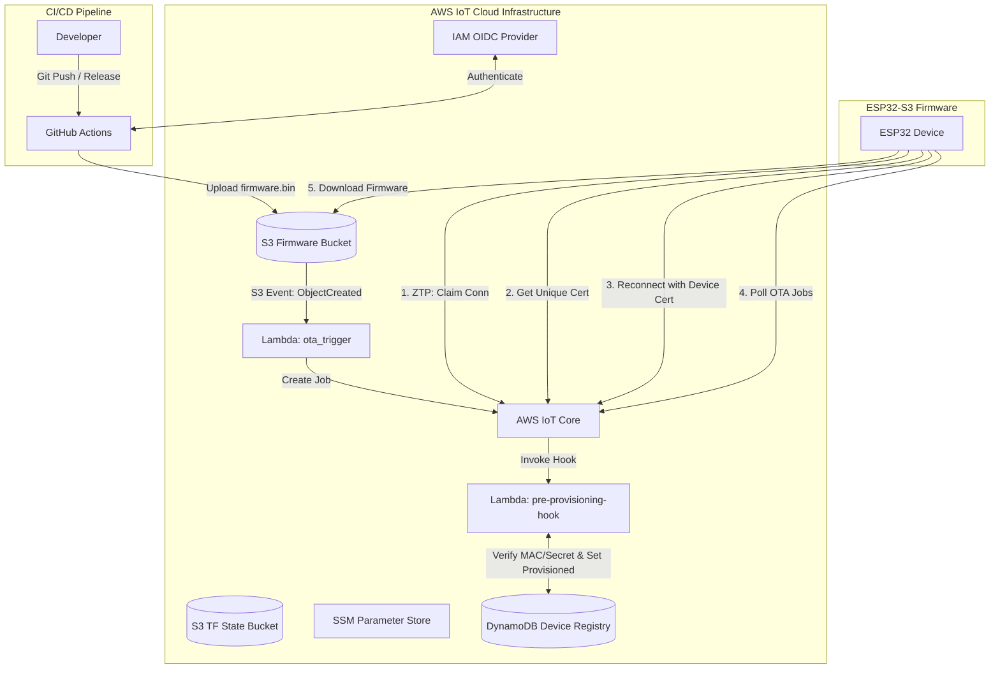
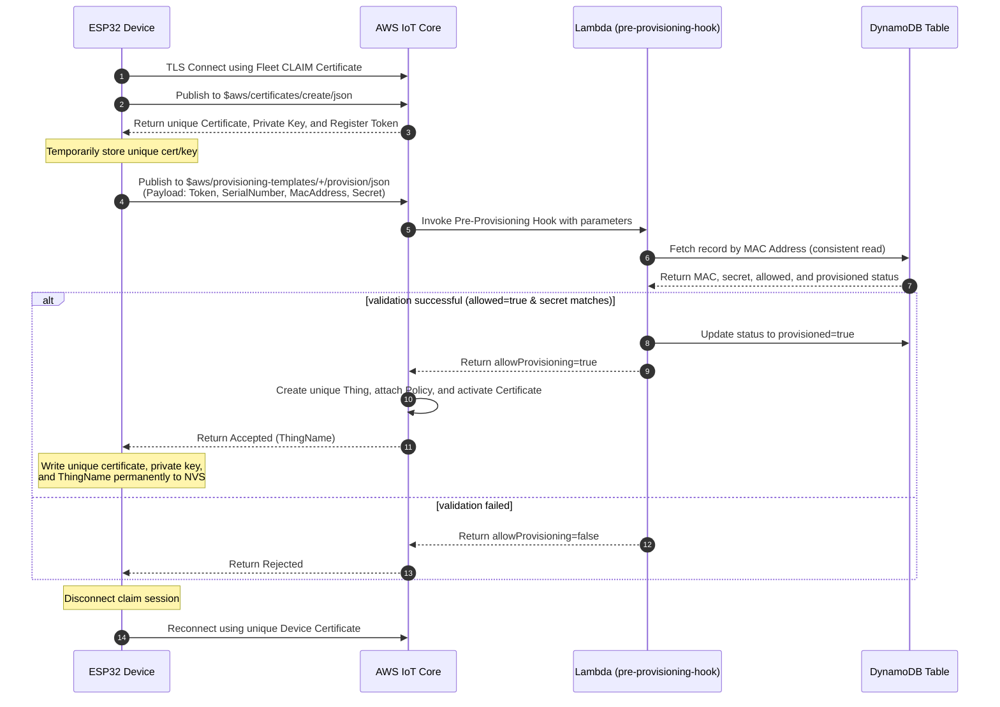
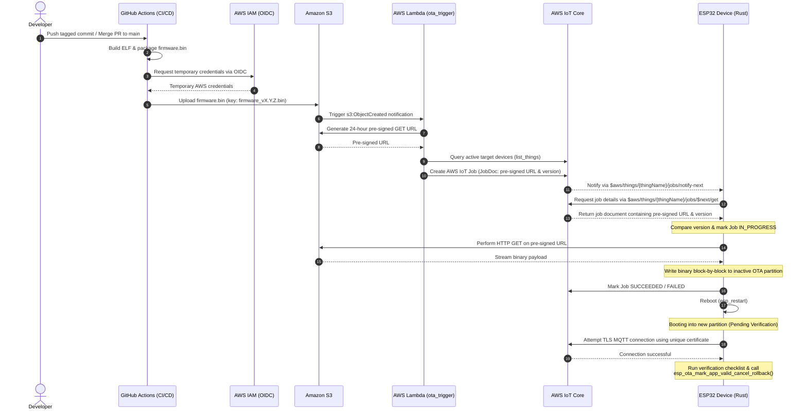

# ESP32 Zero-Touch Provisioning (ZTP) & OTA Platform Infrastructure

This repository contains the Terraform-managed AWS serverless infrastructure that powers **Zero-Touch Fleet Provisioning by Claim (ZTP)** and **Automated, Event-Driven Over-The-Air (OTA) Firmware Updates** for ESP32 devices.

---

## 1. High-Level Solution Architecture

This diagram shows the relationship between developers, GitHub Actions, AWS infrastructure components, and the ESP32 devices:



---

## 2. Zero-Touch Provisioning (ZTP) Flow

ZTP uses **AWS IoT Fleet Provisioning by Claim**. The device leaves the factory with a **common** "claim" (bootstrap) certificate. Upon first connection, it generates its own **unique** certificate, verifies its identity via a pre-provisioning hook, and receives unique credentials.

### ZTP Sequence Diagram



### Security Model
*   **Claim Policy**: Restricts devices to connect and publish/subscribe *only* on provisioning topics (`$aws/certificates/create/*` and `$aws/provisioning-templates/*`). It prevents devices from publishing telemetry or accessing other IoT resources.
*   **Device Policy**: Dynamically restricts each provisioned device using policy variables. Devices can only connect if their `ClientId` matches their `ThingName`. They are restricted to publish to `dt/${iot:Connection.Thing.ThingName}/*` and subscribe to `cmd/${iot:Connection.Thing.ThingName}/*`.
*   **Lambda Hook**: Rejects any request if the device's MAC is missing in DynamoDB, if `allowed` is false, or if the secret mismatches (uses constant-time comparison).

---

## 3. Firmware Release & OTA Flow

The platform provides automatic, event-driven rolling OTA updates triggered when a new firmware binary is uploaded to Amazon S3.

### OTA Sequence Diagram



---

## 4. Setup & Deployment Guide

### Prerequisites
*   Terraform `>= 1.5.0`
*   AWS CLI `v2`
*   Python `3.12` (required to archive Lambda packages during Terraform runs)

### AWS Authentication Configuration
Configure your local environment with credentials for your target AWS account:
```sh
aws configure --profile esp32-ztp
export AWS_PROFILE=esp32-ztp
aws sts get-caller-identity
```

### Terraform Deployment
1.  Initialize remote backend and providers:
    ```sh
    terraform init
    ```
2.  Inspect proposed changes:
    ```sh
    terraform plan
    ```
3.  Deploy:
    ```sh
    terraform apply
    ```

### SSM Parameter Store Integration
Terraform automatically publishes the deployment outputs to the AWS Systems Manager (SSM) Parameter Store. You can read them directly using the AWS CLI or build tools, eliminating the need to parse Terraform state files manually:

```sh
# Fetch the AWS IoT ATS Endpoint
aws ssm get-parameter --name "/esp32-ztp/poc/iot_endpoint" --query "Parameter.Value" --output text

# Fetch the Provisioning Template Name
aws ssm get-parameter --name "/esp32-ztp/poc/provisioning_template_name" --query "Parameter.Value" --output text

# Fetch the Claim Certificate (SecureString - Decrypted)
aws ssm get-parameter --name "/esp32-ztp/poc/claim_certificate_pem" --with-decryption --query "Parameter.Value" --output text

# Fetch the Claim Private Key (SecureString - Decrypted)
aws ssm get-parameter --name "/esp32-ztp/poc/claim_private_key" --with-decryption --query "Parameter.Value" --output text
```

### Secure GitHub Actions OIDC Trust
This infrastructure uses AWS IAM Identity Federation via OpenID Connect (OIDC) to grant secure access to GitHub Actions runners without requiring long-lived AWS secrets to be saved in GitHub.

By default, the role `esp32-ztp-github-actions-role` configured in [iam_github_oidc.tf](file:///Users/eakin/Projects/ergousha/iot-platform-infra/iam_github_oidc.tf) trusts and accepts OIDC connections from **both** of the following repositories on their `main` branches:
1.  `ergousha/esp32-opcua-gateway-rust`
2.  `ergousha/esp32-display-vaktus-salat-rust`

To add a new repository, modify the `github_repositories` variable list in [variables.tf](file:///Users/eakin/Projects/ergousha/iot-platform-infra/variables.tf#L31-L47).

---

## 5. Project Costs & Teardown

### Cost Breakdown
All resources deployed in this repository are serverless and billed purely on-demand, costing **~$0.00 USD/month when idle**:

| Service | Billing Model | PoC Cost |
| :--- | :--- | :--- |
| **IoT Core** | per connectivity-minute & message | Negligible for PoC connections |
| **DynamoDB** | PAY_PER_REQUEST (On-Demand) | Billed per read/write; free tier covers PoC |
| **AWS Lambda** | per invocation & duration | Billed per millisecond; free tier covers PoC |
| **Amazon S3** | per GB-month & requests | Storage cost for binaries is fractions of a cent |
| **CloudWatch Logs** | per GB ingested/stored | Kept low via a 7-day retention period |

### Teardown
To destroy all Terraform-managed resources:
```sh
terraform destroy
```
