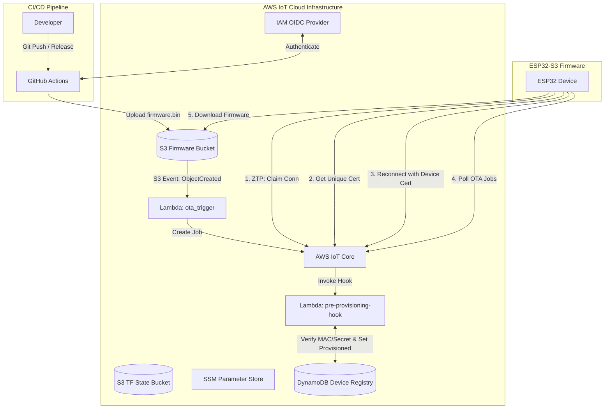
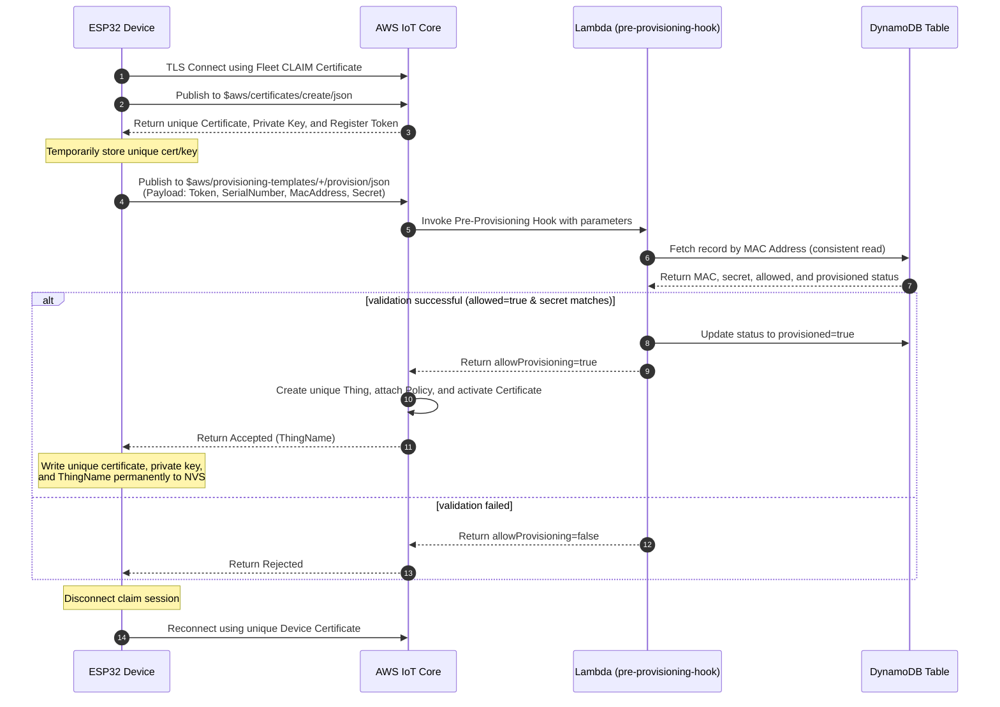
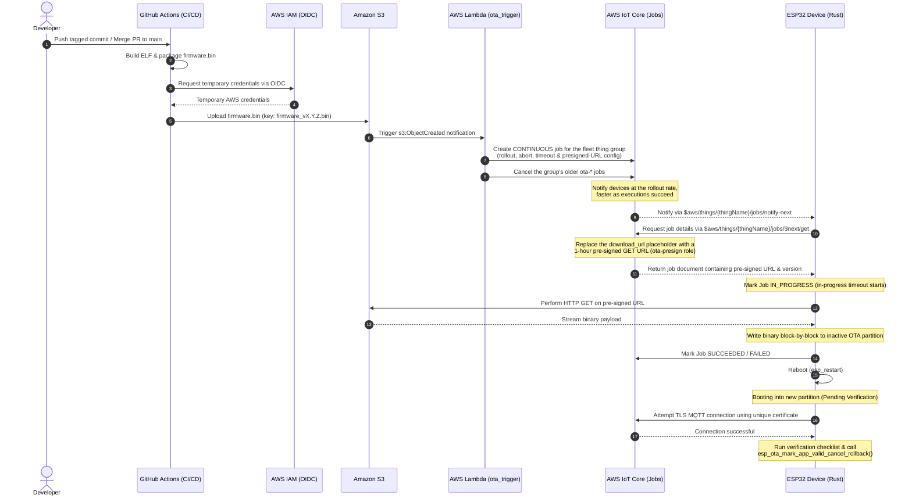

# ESP32 Zero-Touch Provisioning (ZTP) & OTA Platform Infrastructure

This repository contains the Terraform-managed AWS serverless infrastructure that powers **Zero-Touch Fleet Provisioning by Claim (ZTP)** and **Automated, Event-Driven Over-The-Air (OTA) Firmware Updates** for ESP32 devices.

---

## 1. High-Level Solution Architecture

This diagram shows the relationship between developers, GitHub Actions, AWS infrastructure components, and the ESP32 devices:



---

## 2. Zero-Touch Provisioning (ZTP) Flow

ZTP uses **AWS IoT Fleet Provisioning by Claim**. The device leaves the factory with a **common** "claim" (bootstrap) certificate. Upon first connection, it generates its own **unique** certificate, verifies its identity via a pre-provisioning hook, and receives unique credentials.

### ZTP Sequence Diagram



### Security Model
*   **Claim Policy**: Restricts devices to connect and publish/subscribe *only* on provisioning topics (`$aws/certificates/create/*` and `$aws/provisioning-templates/*`). It prevents devices from publishing telemetry or accessing other IoT resources.
*   **Device Policy**: Dynamically restricts each provisioned device using policy variables. Devices can only connect if their `ClientId` matches their `ThingName`. They are restricted to publish to `dt/${iot:Connection.Thing.ThingName}/*` and subscribe to `cmd/${iot:Connection.Thing.ThingName}/*`.
*   **Lambda Hook**: Rejects any request if the device's MAC is missing in DynamoDB, if `allowed` is false, or if the secret mismatches (uses constant-time comparison).

---

## 3. Firmware Release & OTA Flow

The platform provides automatic, event-driven rolling OTA updates triggered when a new firmware binary is uploaded to Amazon S3. Each upload becomes one AWS IoT Job for the **fleet thing group**, rolled out in stages and stopped automatically when too many devices fail.

### OTA Sequence Diagram



The firmware currently reports SUCCEEDED right after the download, before it reboots. [esp32-opcua-gateway-rust#14](https://github.com/ergousha/esp32-opcua-gateway-rust/issues/14) moves that report to the new image, after it has marked itself valid, and reports a rollback as FAILED. From then on, the abort and timeout settings below count real outcomes.

### Thing Groups

| Group | Members | Purpose |
| :--- | :--- | :--- |
| `esp32-ztp-fleet` | Every device the provisioning template registers | Target of every OTA job |
| `esp32-ztp-canary` | The things in `ota_canary_things` (default: the bench unit `28848553144F`) | Child of the fleet group, so it receives every fleet job too. Marks the devices a canary-first rollout would update first |

AWS IoT allows a thing in only one group of a hierarchy. A device provisioned since the fleet group existed is already in it, so to make it a canary, remove it from the fleet group first, then add it to `ota_canary_things` and apply:
```sh
aws iot update-thing-groups-for-thing --thing-name <thing> --thing-groups-to-remove esp32-ztp-fleet
```
If a device provisions again, the template leaves its group membership as it is.

### Job Configuration

| Setting | Terraform variable | Default |
| :--- | :--- | :--- |
| Rollout starts at | `ota_rollout_base_rate_per_minute` | 1 device per minute |
| ... and is multiplied by | `ota_rollout_increment_factor` | 2 |
| ... each time this many more devices succeed | `ota_rollout_succeeded_things` | 5 |
| ... up to | `ota_rollout_max_per_minute` | 20 devices per minute |
| Cancel the job when this share of executions ended FAILED, TIMED_OUT or REJECTED | `ota_abort_failure_percentage` | 20 % |
| ... counted once this many devices have been notified | `ota_abort_min_executed_things` | 10 |
| An execution still IN_PROGRESS after this becomes TIMED_OUT | `ota_in_progress_timeout_minutes` | 30 minutes |

Terraform validates these against the ranges the AWS IoT API accepts, and passes them to the Lambda as environment variables. The Lambda checks them again and refuses to start if any is missing or invalid, rather than create a job without its brakes. `aws iot describe-job --job-id <id>` shows the configuration of a created job.

### One Release in Flight

The job is **CONTINUOUS**, so a device that joins the fleet group later still receives it. A continuous job never completes, though, and a device that joined would receive every older release still active, oldest first. So after creating its job, the Lambda cancels the group's older `ota-*` jobs. It does not force the cancellation: queued executions are dropped, while a device already mid-update finishes and then takes the new job.

The job ID is `ota-<version>-<upload time in ms>`, taken from the S3 event rather than the clock. A redelivered or retried event therefore maps to the job it already created, and "older" means an earlier upload even when invocations run out of order. A failed invocation returns an error, so Lambda retries it; the retry finds the job and finishes the cancellation. Uploading the same file again is a new upload: it creates a new job, which the whole group receives again.

### Download URLs

The job document keeps its fields (`operation`, `firmware_version`, `download_url`), but `download_url` holds an AWS IoT placeholder. Each time a device requests the document, AWS IoT replaces it with a pre-signed GET URL valid for an hour, signed as the `esp32-ztp-ota-presign-role`. A device that joins months after the upload, or is reached late in a slow rollout, never gets an expired URL.

---

## 4. Setup & Deployment Guide

### Prerequisites
*   Terraform `>= 1.5.0`
*   AWS CLI `v2`
*   Go `>= 1.22` (required to compile Go Lambda binaries during Terraform runs)

### AWS Authentication Configuration
Configure your local environment with credentials for your target AWS account:
```sh
aws configure --profile esp32-ztp
export AWS_PROFILE=esp32-ztp
aws sts get-caller-identity
```

### Terraform Deployment
1.  Initialize remote backend and providers:
    ```sh
    terraform init
    ```
2.  Inspect proposed changes:
    ```sh
    terraform plan
    ```
3.  Deploy:
    ```sh
    terraform apply
    ```

### Local Development & VS Code Tasks
To simplify developer workflows, this repository is configured with VS Code Tasks (defined in `.vscode/tasks.json`). You can execute them by opening the Command Palette (`Cmd+Shift+P` / `Ctrl+Shift+P`), typing `Tasks: Run Task`, and selecting one of the following:

*   **Go: Build Lambdas**: Compiles both Go Lambda functions for Linux/AMD64.
*   **Go: Run Unit Tests**: Runs all unit tests with verbose logging (`go test -v ./...`).
*   **Go: Format Code**: Formats Go code styling (`gofmt -s -w .`).
*   **Go: Lint Code**: Audits Go code quality using `golangci-lint`.
*   **Go: Clean Binaries**: Cleans up local builds and temporary ZIP archives.
*   **Terraform: Format Files**: Rewrites Terraform files into canonical format (`terraform fmt`).
*   **Terraform: Validate**: Initializes modules and validates Terraform structure (`terraform init -backend=false && terraform validate`).
*   **Terraform: Lint (TFLint)**: Audits Terraform configurations using `tflint`.

### SSM Parameter Store Integration
Terraform automatically publishes the deployment outputs to the AWS Systems Manager (SSM) Parameter Store. You can read them directly using the AWS CLI or build tools, eliminating the need to parse Terraform state files manually:

```sh
# Fetch the AWS IoT ATS Endpoint
aws ssm get-parameter --name "/esp32-ztp/poc/iot_endpoint" --query "Parameter.Value" --output text

# Fetch the Provisioning Template Name
aws ssm get-parameter --name "/esp32-ztp/poc/provisioning_template_name" --query "Parameter.Value" --output text

# Fetch the Claim Certificate (SecureString - Decrypted)
aws ssm get-parameter --name "/esp32-ztp/poc/claim_certificate_pem" --with-decryption --query "Parameter.Value" --output text

# Fetch the Claim Private Key (SecureString - Decrypted)
aws ssm get-parameter --name "/esp32-ztp/poc/claim_private_key" --with-decryption --query "Parameter.Value" --output text
```

### Secure GitHub Actions OIDC Trust
This infrastructure uses AWS IAM Identity Federation via OpenID Connect (OIDC) to grant secure access to GitHub Actions runners without requiring long-lived AWS secrets to be saved in GitHub.

By default, the role `esp32-ztp-github-actions-role` configured in [iam_github_oidc.tf](file:///Users/eakin/Projects/ergousha/iot-platform-infra/iam_github_oidc.tf) trusts and accepts OIDC connections from **both** of the following repositories on their `main` branches:
1.  `ergousha/esp32-opcua-gateway-rust`
2.  `ergousha/esp32-display-vaktus-salat-rust`

To add a new repository, modify the `github_repositories` variable list in [variables.tf](file:///Users/eakin/Projects/ergousha/iot-platform-infra/variables.tf#L31-L47).

---

## 5. Project Costs & Teardown

### Cost Breakdown
All resources deployed in this repository are serverless and billed purely on-demand, costing **~$0.00 USD/month when idle**:

| Service | Billing Model | PoC Cost |
| :--- | :--- | :--- |
| **IoT Core** | per connectivity-minute & message | Negligible for PoC connections |
| **DynamoDB** | PAY_PER_REQUEST (On-Demand) | Billed per read/write; free tier covers PoC |
| **AWS Lambda** | per invocation & duration | Billed per millisecond; free tier covers PoC |
| **Amazon S3** | per GB-month & requests | Storage cost for binaries is fractions of a cent |
| **CloudWatch Logs** | per GB ingested/stored | Kept low via a 7-day retention period |

### Teardown
To destroy all Terraform-managed resources:
```sh
terraform destroy
```
